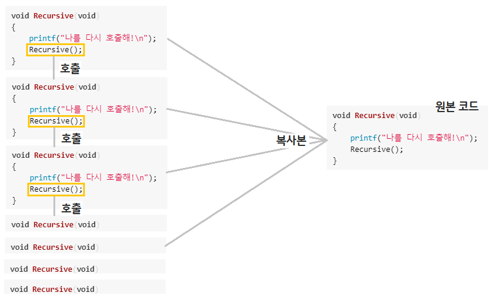

# 재귀
## 재귀함수란?
함수 내에서 자기 자신을 다시 호출하는 함수를 말한다.

``` C
void Recursive(void)
{
    printf("나를 다시 호출해!\n");
    Recursive();
}
```
위의 함수는 아래 사진과 같이 동작한다.

> `Recursive` 함수를 실행하는 중간에 다시 `Recursive` 함수가 호출되면, `Recursive` 함수의 복사본을 하나 더 만들어서 복사본을 실행하게 된다.

실제로 함수를 구성하는 명령문은 CPU로 복사되어 실행된다. 그렇기 때문에 함수 실행 중간에 다시 함수를 호출할 수 있는 것이다.

하지만 위의 코드는 한 번 호출되면 무한 루프에 걸리는 문제가 생긴다. 이럴 때는 탈출 조건을 만들어 주면 된다.

``` C
#include <stdio.h>

void Recursive(int num)
{
    if(num <= 0) // 재귀의 탈출 조건
        return; // 재귀의 탈출
    printf("나를 %d번 호출해!\n", num);
    Recursive(num - 1);
}

int main()
{
    Recursive(3);
    return 0;
}
```

실행 결과는 아래와 같다.

```
나를 3번 호출해!
나를 2번 호출해!
나를 1번 호출해!
```
## 재귀의 활용
### 피보나치 수열(Fibonacci Sequence)
피보나치 수열은 아래와 같다.

```
0, 1, 1, 2, 3, 5, 8, 13, 21, 34, 55 . . .
```

간단히 말하면 **앞의 수를 두 개 더해 현재의 수를 만들어 가는 수열**이다. 일반화하면 다음과 같다.

```
수열의 n번째 값 = 수열의 n-1번째 값 + 수열의 n-2번째 값 // 수열의 n번째 값은 수열의 첫 번째와 두 번째 값을 제외한다
```

이를 코드로 옮기면 다음과 같다.

``` C
int Fibo(int n) // 피보나치 수열의 n번째 값 반환
{
    if(n == 1) // 피보나치 수열의 첫 번째 값을 요구하면
        return 0; // 0 반환
    else if(n == 2) // 두 번째 값을 요구하면
        return 1; // 1 반환
    else // 세 번째 이후의 값을 요구하면
        return Fibo(n - 1) + Fibo(n - 2);
}
```

### 하노이 타워(The Tower of Hanoi)
하노이 타워는 아래 그림과 같은 형식의 교구를 말한다.


하노이 타워는 세 개의 축과 n개의 원반이 주어진다. 각각의 원반은 크기가 모두 다르다. 세 개의 축을 사진에 표시된 것처럼 A, B, C라고 부르기로 하자. 위 사진은 원반이 `n = 5`개인 하노이 타워이다.

A축에 있는 다섯 개의 원반을 옮기려면 어떻게 옮겨야 할까? 하노이 타워에서 원반을 옮기는 데에는 아래와 같은 조건이 있다.

> 원반은 한 번에 하나씩만 옮길 수 있으며, 옮기는 과정에서 작은 원반의 위에 큰 원반이 올려져서는 안 된다.

쉽게 `n = 2`로 두고 문제를 풀어 보자.

#### 시작할 때의 상태


#### 1단계: 원반 1을 축 A에서 C로 옮김


#### 2단계: 원반 2를 축 A에서 B로 옮김


#### 3단계: 원반 1을 축 C에서 B로 옮김


`n`이 점점 커진다고 어려워할 것 없다. 재귀를 이용하면 간편하게 문제를 해결할 수 있다.

이동할 원반의 개수가 `num`개인 하노이 타워를 축 `from`에서 `by`를 거쳐 `to`로 이동하는 코드는 아래와 같다.

``` C
void HanoiTowerMove(int num, char from, char by, char to)
{
    if(num == 1) // 이동할 원반의 수가 1개라면
    {
        printf("원반 1을 %c에서 %c로 이동\n", from, to);
    }
    else
    {
        HanoiTowerMove(num-1, from, to, by);
        printf("원반 %d을(를) %c에서 %c로 이동\n", num, from, to);
        HanoiTowerMove(num-1, by, from, to);
    }
}

int main()
{
    // 막대 A에 있는 원반 3개를 막대 B를 경유하여 C로 옮긴다
    HanoiTowerMove(3, 'A', 'B', 'C');
    return 0;
}
```